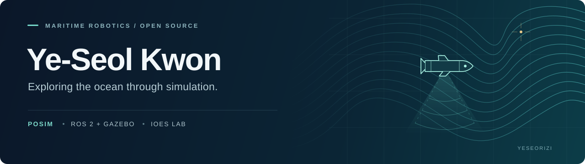

  

  <a href="https://github.com/IOES-Lab/POSIM"><strong>POSIM</strong></a>
  &nbsp; / &nbsp;
  <a href="https://ioes-lab.github.io/POSIM/">Documentation</a>
  &nbsp; / &nbsp;
  <a href="https://github.com/yeseorizi/ArcticMap">ArcticMap</a>
  &nbsp; / &nbsp;
  <a href="https://github.com/search?q=is%3Apr+author%3Ayeseorizi&amp;type=pullrequests">Open-source contributions</a>

 

I'm **Ye-Seol Kwon (권예설)**, working on underwater robotics simulation at the **IOES Lab, Korea Maritime & Ocean University**.

I contribute to **POSIM** and the ROS 2 / Gazebo ecosystem. My work includes migrating simulation environments, checking sensor behavior, and fixing problems found while installing, running, and stopping simulations.

### Projects

#### 01 &nbsp; POSIM
**Platform for Ocean Simulation**

An open maritime-robotics simulation platform continuing Project DAVE. I contribute to ROS 2 / Gazebo migration, sensor and launch fixes, Docker-based validation, and installation documentation.

[Repository →](https://github.com/IOES-Lab/POSIM) &nbsp; [Documentation →](https://ioes-lab.github.io/POSIM/)

#### 02 &nbsp; ArcticMap
**Sea-ice data, explored on a map**

A map-based project for exploring Arctic sea-ice data, with selectable data layers, date controls, and animated views.

[Repository →](https://github.com/yeseorizi/ArcticMap) &nbsp; [Live map →](https://arctic-map.vercel.app/)

### Selected contributions

- **ROS–Gazebo bridge** — Broke a shared-ownership cycle in the parameter bridge. [ros_gz #952](https://github.com/gazebosim/ros_gz/pull/952)
- **DAVE migration** — Updated the platform to ROS 2 Lyrical and Gazebo Jetty. [dave #65](https://github.com/IOES-Lab/dave/pull/65)
- **Underwater camera** — Added handling for invalid frames while preserving Gazebo signal handling. [POSIM #5](https://github.com/IOES-Lab/POSIM/pull/5)

These are merged contributions. More work and discussions are available in my <a href="https://github.com/search?q=is%3Apr+author%3Ayeseorizi&amp;type=pullrequests">pull requests</a>.

### Working with

`ROS 2` &nbsp; `Gazebo` &nbsp; `Docker` &nbsp; `C++` &nbsp; `Python` &nbsp; `Git`

I'm continuing to build my skills in C++, debugging, and reproducible testing, with a growing interest in GPU-based sonar simulation.

 

---

Ocean engineering · Simulation software · Learning through open source
